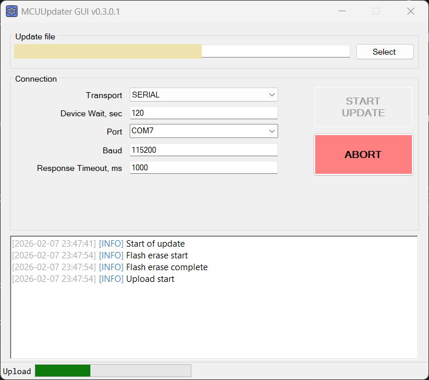
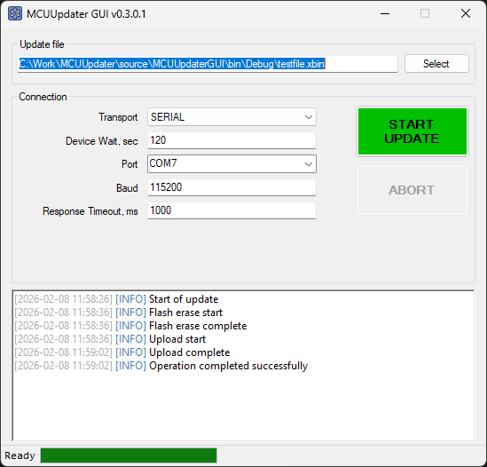

# MCUUpdater

**MCUUpdater** — это утилита для обновления прошивки микроконтроллера с помощью пользовательского загрузчика (bootloader) через Serial port (RS232, RS485, USB-SERIAL, и т.д.) и через TCP-RAW (Ethernet, TCP-Serial переходники).  
Является клиенской стороной и реализует протокол обмена данными с загрузчиком [PolyBoot](https://github.com/DiMoonElec/PolyBoot).  

## ⚙️ Требования

- .NET Framework 4.7.2  
- Windows 7 или более актуальная версия

## 📥 Установка

Инсталлятор актуальной версии можно скачать [по этой ссылке](https://github.com/DiMoonElec/MCUUpdater/releases/latest).

Для работы утилиты необходим .NET Framework 4.7.2, скачать его можно с официального сайта Microsoft.

## 🖥️ GUI-версия

GUI-версия утилиты является интуитивно понятной, нужно выбрать файл обновления .xbin, установить параметры соединения (значения можно подсмотреть в инструкции на девайс, ну или спросить у разраба данного девайса), и нажать на START UPDATE:




## 📟 Консольная версия

Консольная версия позволяет запустить обновление из коммандной строки, или из какой-либо системы автоматизации действий. Инсталлятор прописывает путь к MCUUpdater.exe в PATH-переменную окружения, поэтому, полный путь к MCUUpdater можно не прописывать.

### Показать справку:
```bash
MCUUpdater -h
```

### Команда обновления прошивки удаленного устройства:
```bash
MCUUpdater [-w 60] [-v] update -f <filename> <transport> [transport-options]
```
Последовательность ключей такая:  
- необязательные ключи  ```[-w 60]```, ```[-v]```
- ```update``` - выполнить команду обновления прошивки, она имеет один обязательный параметр ```-f <filename>```
- ```<transport>``` - транспорт, который будет использовать команда ```update``` для связи с удаленным устройством.
---

### Global options

```
[-h]          Показать справку
[-w <sec>]    Максимальное время ожидания появления устройства (по умолчанию 60)
[-v]          Расширенный (отладочный) вывод
```

---

### Варианты транспорта

#### `serial` - последовательный COM-порт

```
serial -p <COMx> [-b 115200] [-r 2]
```

#### `raw-tcp`

```
raw-tcp -H <host> [-p 5000] [-t 2] [-r 2]
```

### Тайм-ауты (семантика)

* `-w, --wait`
  Глобальный тайм-аут ожидания появления устройства и начала обновления

* `-t, --connect-timeout`
  Тайм-аут одной попытки установления сетевого соединения (TCP)

* `-r, --response-timeout`
  Тайм-аут ожидания ответа устройства на запрос
  (присутствует у всех транспортов, необязательный, по умолчанию 2 секунды)

### Примеры

```bash
MCUUpdater update -f fw.xbin serial -p COM7 -b 115200
```

```bash
MCUUpdater update -f fw.xbin raw-udp -H 10.0.0.5 -p 7777
```


## 📄 Лицензия
Проект распространяется под лицензией GPL-3.0 license.

## 🔮 Планы

Расширение списка поддерживаемых интерфейсов связи